# 냉구 (Naengu) — Backend

> 냉장고 속 재료를 관리하고, 가진 재료로 만들 수 있는 레시피를 추천받는 서비스

**냉구**는 **냉**장고를 **구**해줘의 줄임말입니다.
냉구는 **"지금 내 냉장고에 뭐가 있지?"** 라는 일상적인 고민을 해결합니다.
재료를 등록하면 어울리는 레시피를 추천받고, 레시피 후기를 작성하거나 다른 사용자의 요리 게시글을 피드로 확인할 수 있습니다.

## 주요 기능

| 도메인 | 기능 |
|---|---|
| **냉장고 재료** | 재료 등록 · 수정 · 삭제, 카테고리별 분류 및 순서 변경 |
| **재료 추천** | 냉장고 재료 기반 유사 재료 자동 추천 |
| **레시피** | 레시피 등록 (텍스트/링크), 태그별 추천 조회, 상세 조회 |
| **레시피 찜** | 레시피 찜 추가 · 취소, 내 찜 목록 커서 페이징 조회 |
| **레시피 후기** | 레시피에 후기 등록, 후기 목록 조회 |
| **게시글 & 피드** | 게시글 작성 · 수정 · 삭제, 전체 피드 / 내 피드 조회 |
| **프로필** | 프로필 조회 · 수정 (닉네임, 소개, 프로필 이미지) |
| **인증** | Kakao OAuth 2.0 로그인, JWT 기반 인증 |

## 백엔드 팀원

| 이름 | 역할 | GitHub |
|---|---|---|
| 다빈 👑 | 백엔드, 인프라 | [@parking-been](https://github.com/parking-been) |
| 세진 | 백엔드, 인프라 | [@sejinezy](https://github.com/sejinezy) |

## 화면 소개

⚠️ 레시피 데이터는 외부 Open API 기반이며, API에서 사진을 제공하지 않아 목업 데이터 외의 레시피는 기본 이미지로 표시됩니다.

| 전체 화면 로직 (gif)                                 | 홈화면                                           |
|------------------------------------------------|-----------------------------------------------| 
| 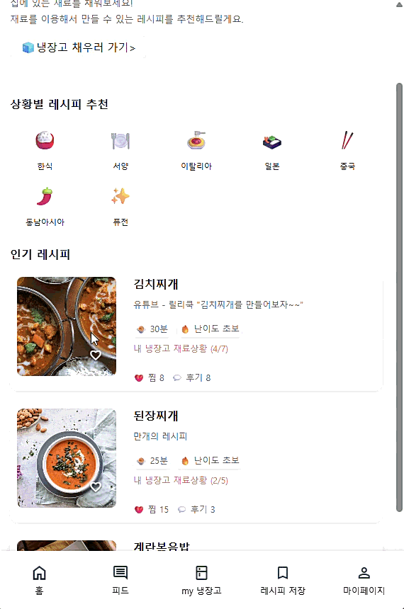 | 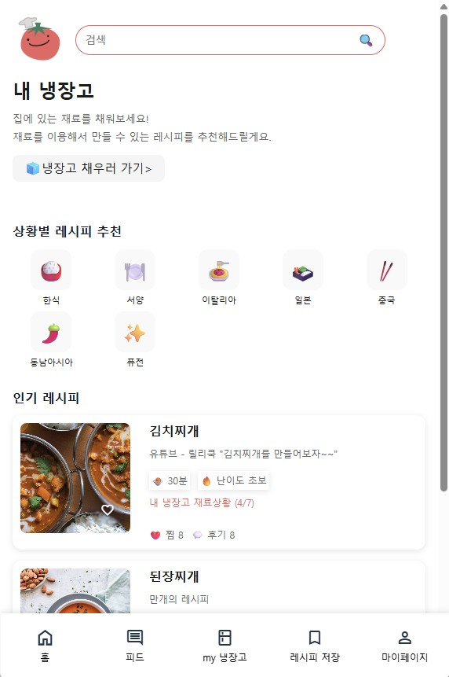 |


| 내 냉장고 로직 (gif)                      | 냉장고 재료 관리                                           | 재료 추천                                            |
|-------------------------------------|-----------------------------------------------------|--------------------------------------------------|
| 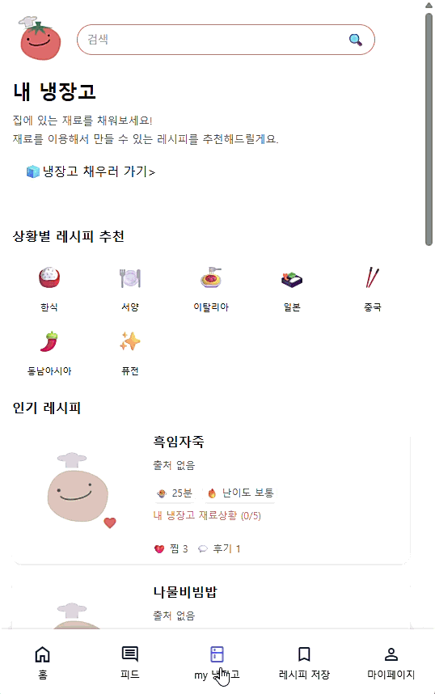 | 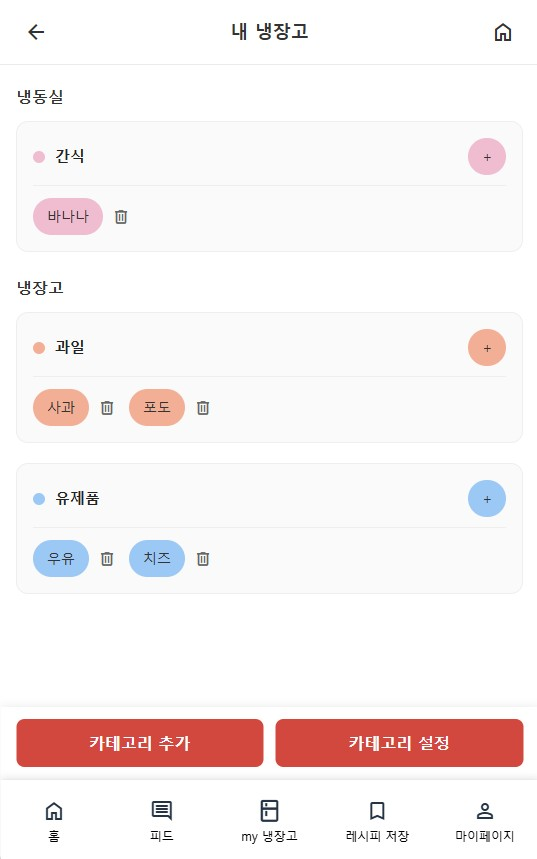 | 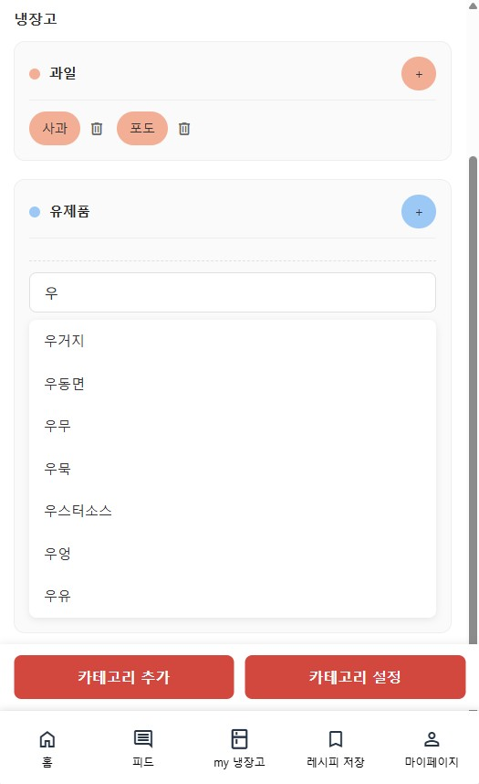 |

| 레시피 조회                                       | 레시피 상세페이지_1                                          | 레시피 상세페이지_2                                          |
|----------------------------------------------|------------------------------------------------------|------------------------------------------------------|
| 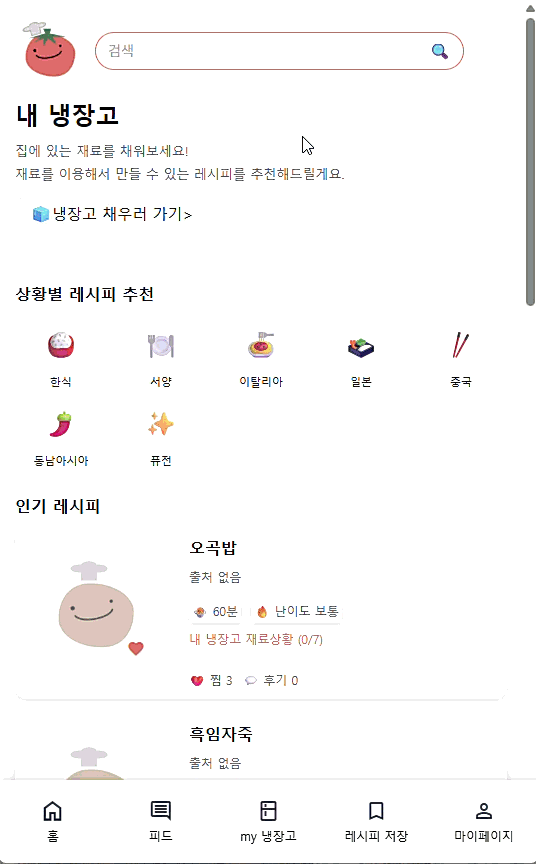 | 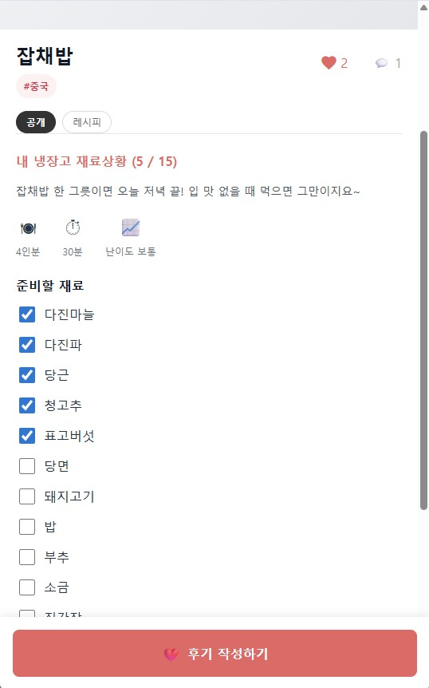 | 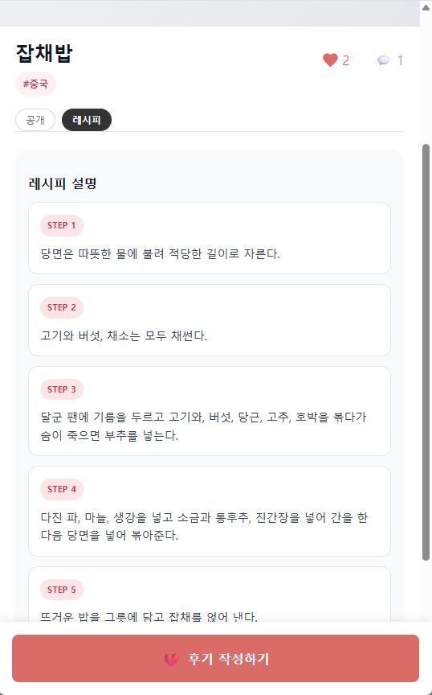 |

| 피드                                           | 게시글 작성(gif)                                      |
|----------------------------------------------|--------------------------------------------------|
| 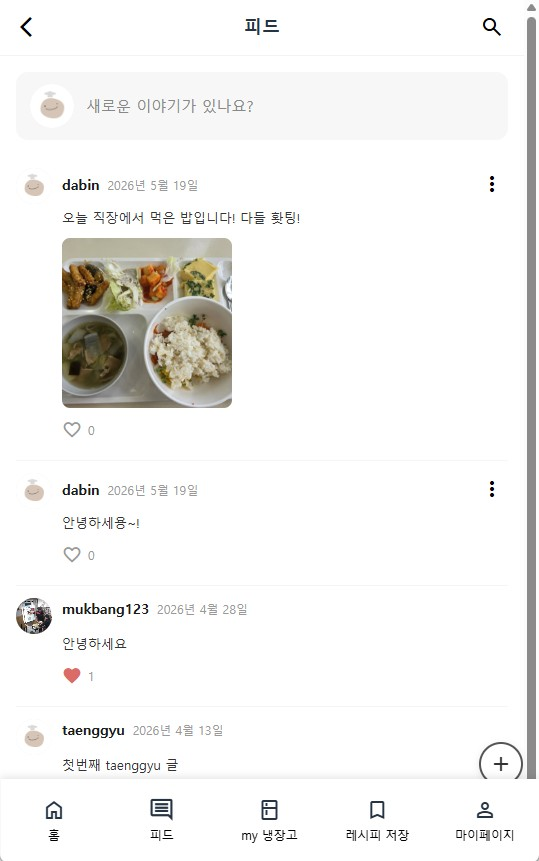 | 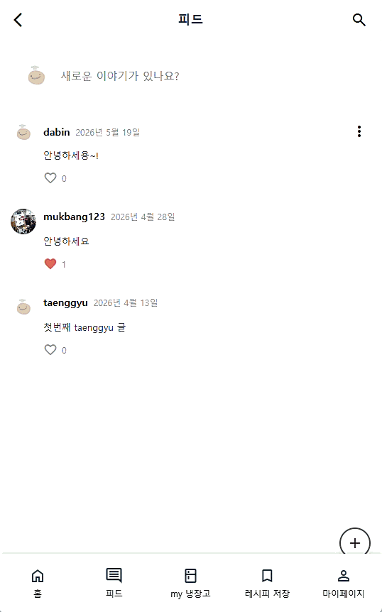 |

| 프로필 (gif)                                  | 레시피 후기                                           |
|--------------------------------------------|--------------------------------------------------|
| 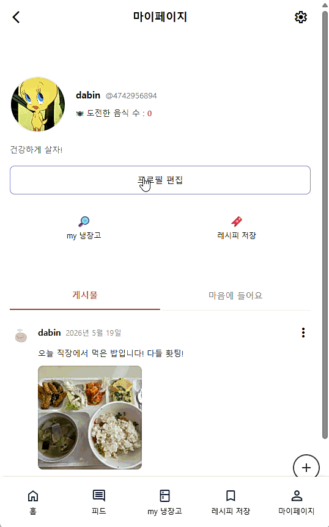 | 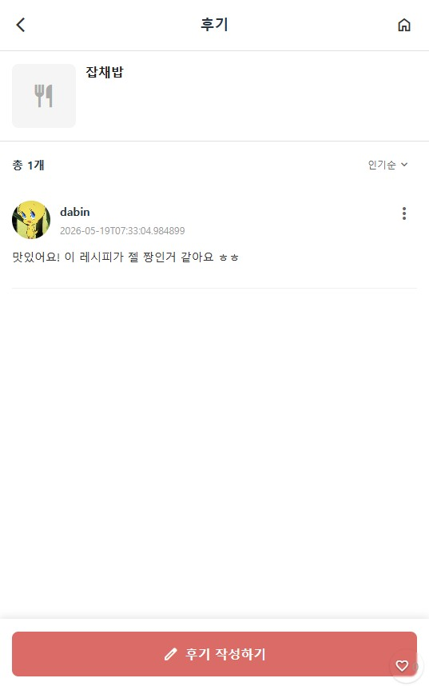 |


## 기술 스택

| 분류 | 기술 |
|---|---|
| Language | Java 21 |
| Framework | Spring Boot 4.0.1 |
| ORM | Spring Data JPA (Hibernate) |
| DB | MySQL (prod) / H2 (test) |
| Auth | Kakao OAuth 2.0 + JWT |
| Storage | Amazon S3 |
| API 문서 | SpringDoc OpenAPI (Swagger UI) |
| Infra | AWS EC2 · RDS · S3 · Route 53 |
| CI/CD | GitHub Actions + Docker + Docker Compose |

## ERD

### 도메인 다이어그램
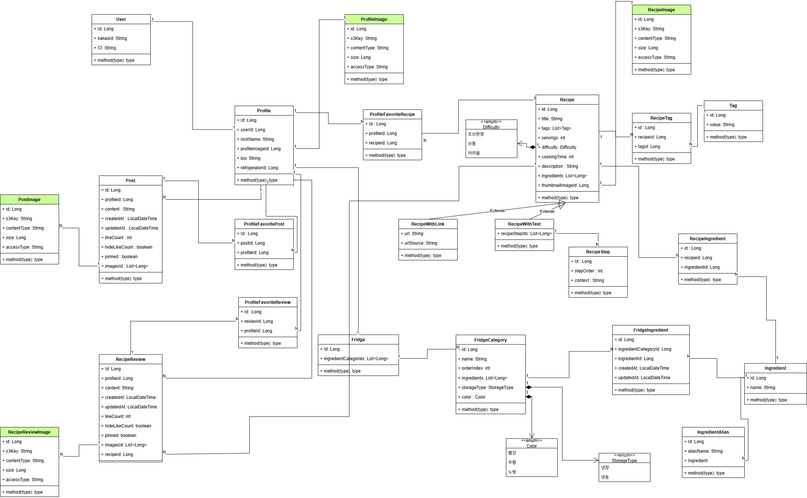

### ERD 구조도
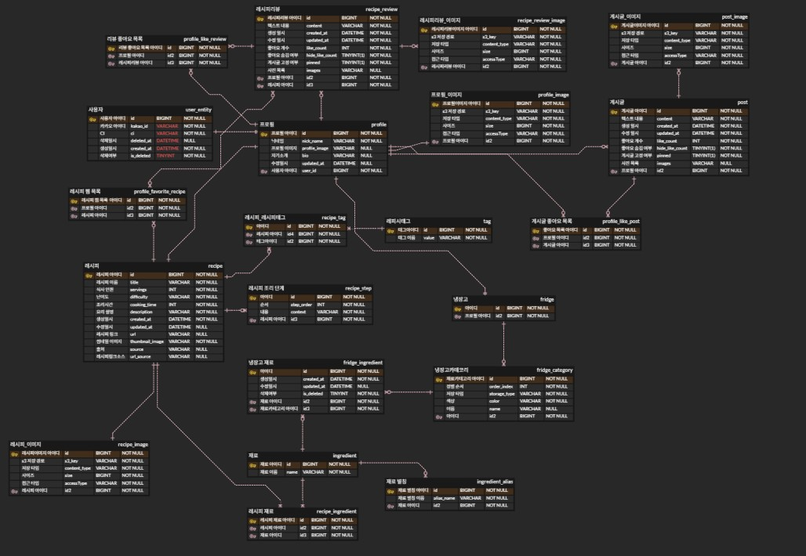

## 아키텍처

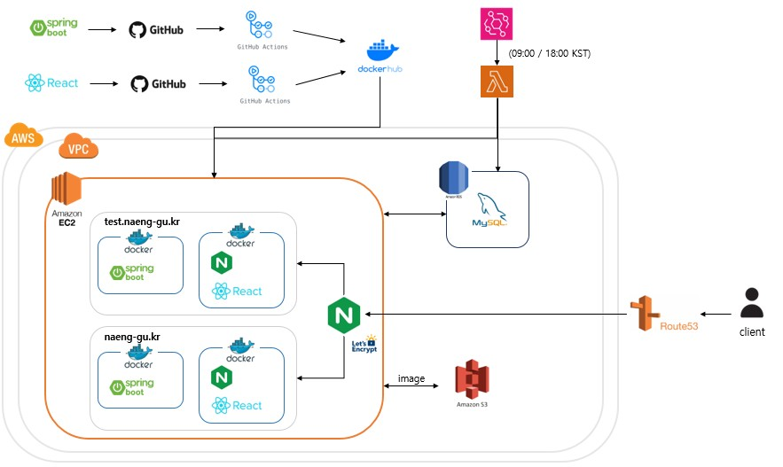

서비스 인프라 구성, CI/CD 파이프라인, 전체 요청 흐름은 아래 문서를 참고하세요.

[아키텍처 문서 보기](docs/architecture.md)

## 로컬 실행

MySQL이 필요합니다. `application-local.yml`에 설정된 `127.0.0.1:3306/naenggu`에 DB를 준비한 후 실행합니다.

```bash
./gradlew bootRun --args='--spring.profiles.active=local'
```

실행 후 Swagger UI: [http://localhost:8080/swagger-ui/index.html](http://localhost:8080/swagger-ui/index.html)

## 빌드 & 테스트

```bash
# 빌드
./gradlew build

# 테스트 제외 빌드
./gradlew build -x test

# 전체 테스트
./gradlew test

# 특정 테스트 클래스 실행
./gradlew test --tests "com.potatoes.Naengu.CategoryCommandServiceDataJpaTest"
```

## 패키지 구조

```
com.potatoes.Naengu
├── fridge/
├── ingredient/
├── recipe/
├── profile/
├── post/
├── oauth/
├── auth/
├── file/
├── healthcheck/
└── global/
    ├── api/          # Api<T> 응답 래퍼, GlobalExceptionHandler
    ├── exception/    # ErrorCode 인터페이스, ApiException
    └── validation/
```

각 도메인은 `controller` · `service` · `repository` · `domain/model` · `dto` · `exception` 레이어로 구성됩니다.

## 환경 변수 (프로덕션)

| 변수 | 설명 |
|---|---|
| `SPRING_DATASOURCE_URL/USERNAME/PASSWORD` | MySQL 접속 정보 |
| `KAKAO_CLIENT_ID/SECRET/REDIRECT_URI` | Kakao OAuth |
| `JWT_SECRET_KEY` | JWT 서명 키 |
| `AWS_CRED_ACCESS_KEY/SECRET_KEY` | S3 접근 키 |
| `AWS_REGION` | AWS 리전 |
| `S3_BUCKET` / `S3_ENDPOINT` | S3 버킷 정보 |
| `REDIRECT_FRONT_URL` / `APP_SERVER_URL` | 서비스 URL |
